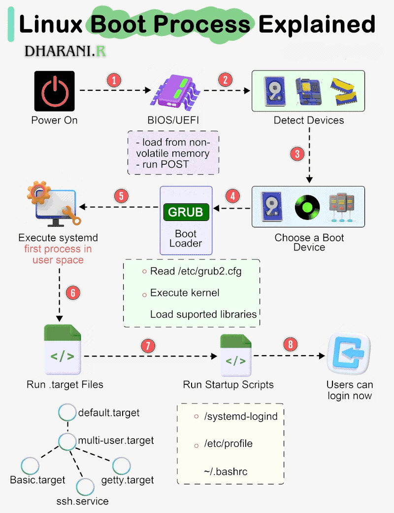

# What happens when we turn on computer

The Linux boot sequence is the series of steps that occur from powering on a system to reaching a usable login prompt. 


## Steps of Boot Process

### 1. Power Supply Initialization
The process begins when the power supply unit (PSU) sends electricity to the computer’s essential components such as:
* Motherboard
* Processor (CPU)
* Memory (RAM)
* Hard drive or SSD
* Cooling fans

### 2. BIOS/UEFI Startup and POST 
* When a system is first booted, or is reset, the processor executes code at a well-known location. In a personal computer (PC), this location is in the basic input/output system `(BIOS)`, which is stored in flash memory on the motherboard.

Modern computers contain a BIOS `(Basic Input/Output System)` or UEFI `(Unified Extensible Firmware Interface)` firmware chip. This firmware is responsible for:

* *Power-On Self-Test (POST)*: The POST checks whether critical hardware components like RAM, CPU, video card, and storage devices are functioning correctly.
* *Error Handling*: If an issue is detected, the system either displays an error message on the screen or emits a series of beeps called POST beep codes.
* *Hardware Initialization*: The BIOS/UEFI configures connected devices and prepares the system for the next stage of booting.

### 3. Loading the Boot Loader (MBR and UEFI Process) - stage 1
Once [POST](Power-on-self-test) completes successfully, the `BIOS/UEFI` looks for a bootable device based on the configured boot order (hard drive -> USB -> DVD, etc.).
* In traditional systems, the BIOS searches the Master Boot Record (MBR) located in the first sector of the boot disk. The boot sector contains a small program known as the **boot loader**.
* When a boot device is found, the first-stage **boot loader** is loaded into RAM and executed. The job of the boot loader is to load the actual operating system kernel into memory.
* Common bootloaders: `GRUB`, `systemd-boot`, `LILO`, `U-Boot`.

### 4. Kernel and Init Process - stage 2
After the boot loader runs, the OS kernel is loaded into RAM. The kernel is the core of the operating system and performs various tasks.
* The kernel decompresses, initializes CPU scheduling, memory management, and cheks attached hardware drivers, mounts the root device, and then loads the necessary kernel modules.
* The final step of kernel initialization is to start the init process `first user-space program`  (`PID 1`), typically **systemd**.

> The first- and second-stage boot loaders combined are called Linux Loader (LILO) or `GRand Unified Bootloader` (GRUB)
> The first application or init process started is at `/sbin/init`

### 5. Starting System Services and Daemons
The init/systemd process then launches background services known as `daemons`, such as:
  * Networking services
  * Printing services
  * Security services
  * logging services
  * Graphical display manager (X server or Wayland)

**Note**: At this point, the system either displays a login screen (GUI) or a command-line login prompt.

### 6. User Login and Desktop Environment
Finally, after the user logs in, the OS loads the desktop environment (such as Windows Desktop, macOS Finder, or Linux GNOME/KDE). This gives the user a graphical interface to interact with applications and the underlying hardware.

### Functions of BIOS/UEFI During Boot
* **POST**: Tests hardware devices to ensure they function properly.
* **MBR/GPT Handling**: Locates and loads the boot loader from the storage device.
* **init**: It is used to determine the initial run level of the system.
* **System Configuration**: Allows users to set time/date, boot order, CPU and memory settings.
* **Security Features**: Provides password protection, secure boot, and TPM (Trusted Platform Module) support.

---
# How Linux Kernel Boots


### 1. BIOS/UEFI and Power-On Self-Test (POST)
When we press the power button of your system, BIOS (Basic Input/Output System) or UEFI (Unified Extensible Firmware Interface) initiates the boot process.

**Power-On Self-Test (POST)**: The POST procedure is carried out by the BIOS/UEFI control which will do a basic device check on the most important hardware components which includes the RAM, CPU, and storage devices (HDD, SSD, and USB). If something goes wrong (for example: broken GPU), POST will abort the booting process and signal the user with a series of beeps or error codes.

**Storage Initialization**: The BIOS/UEFI will try to find and set up connected storage devices while looking for media files that can be used to boot the computer. 

**Bootloader Search**: BIOS will look into the MBR on the first storage device to find the bootloader (like `GRUB`). UEFI does not go through the MBR but rather goes directly to the boot loader location in the EFI System Partition (ESP). it can find the boot loaders on a certain predefined folder path (/EFI/).

### 2. Role of Boot Loaders in the Linux Boot Process
> A `boot loader` is a crucial component in the Linux boot process that initializes the system by loading the Linux kernel and passing necessary boot parameters. It is the first software that runs once the system's BIOS/UEFI firmware completes the Power-On Self-Test (POST) and finds a bootable disk.

Boot Loader Tasks:
1. Select from multiple kernels.
2. Switch between sets of kernel parameters.
3. Provide support for booting different operating systems.
3. Load `initrd/initramfs` to prepare the system before mounting the root filesystem.
> In Linux booting, `initrd `(Initial RAM Disk) and `initramfs` (Initial RAM Filesystem) are mechanisms to provide a temporary root filesystem in memory before the actual root filesystem is mounted. Both serve the same purpose — preparing the environment for the kernel to mount the real root — but differ in implementation and efficiency.
4. Pass kernel arguments such as `ro` (read-only root), `quiet` (disable verbose boot messages), `nomodeset` (disable graphics drivers for troubleshooting).
5. Recover from boot failures by providing a minimal recovery shell in case of errors (GRUB rescue mode).

```ini
GRUB - Grand Unified Boot Loader. 

One of GRUB’s most vital capabilities is filesystem navigation that enables straightforward kernel image and configuration choice.

* The core initializes. At now, GRUB will currently access disks and filesystems.
* GRUB identifies its boot partition and hundreds of configurations there.
* GRUB offers the user an opportunity to vary the configuration.
* GRUB executes the configuration after a timeout or user action.

In the course of execution of the configuration, GRUB might load further code within the boot partition. a number of these modules are also preloaded.
* To load and execute the kernel GRUB executes boot commands.
```

### 3. Linux Kernel Initialization and Boot Parameters
Once the boot loader `GRUB` loads the Linux kernel into memory, the kernel initialization process begins. The Linux kernel is responsible for hardware detection, memory management, device driver loading, and starting system services.

**Kernel Initialization and Boot Options:**
* CPU examination
* Memory examination
* Device bus discovery
* Device discovery
* Auxiliary kernel system setup
* Root filesystem mount
* User-space begin.
> When the Linux kernel starts, it receives a group of text-based kernel parameters containing some further system details.

Before mounting the actual root filesystem, the Linux kernel loads an initial, temporary filesystem called `initrd` or `initramfs`.

1. `initrd (Initial RAM Disk)` – A compressed block-based filesystem that includes essential drivers and utilities needed for booting.
2. `initramfs (Initial RAM Filesystem)` – A modern replacement for initrd, it is a `cpio` archive that does not require mounting and loads directly into RAM.

### 4. Init System (systemd) and Runlevels in the Linux Boot Process
When the kernel is initialized, the subsequent Linux boot process action progresses into the `init` system, which handles system services, processes, and sessions. The init system takes care of provisioning all required background services such as networking, logging, and the system daemons in the right sequence.

There are three major init systems used in different Linux distributions: we only focus on `systemd`
* The system runs a set of **startup scripts and configure the environment**.

### Step 5. Reaching the User Login Prompt in the Linux Boot Process
After all the system services are loaded, the last part of the Linux boot phase is reached, which is displaying the user login prompt.`CLI vs GUI` Login in Linux Boot Process

#### 1. For CLI (Multi-User Target):
* The system boots into multi-user mode and presents a TTY terminal login prompt.
* Users type their credentials to log in.
* Used in servers or light versions of Linux.

#### 2. For GUI (Graphical Target):
* The display manager (GDM, LightDM, SDDM, Xorg, Wayland) starts the graphical login screen.
* Then, users can log in on a graphical secession, for example, GNOME, KDE, or XFCE.
* Common in desktop environments.

