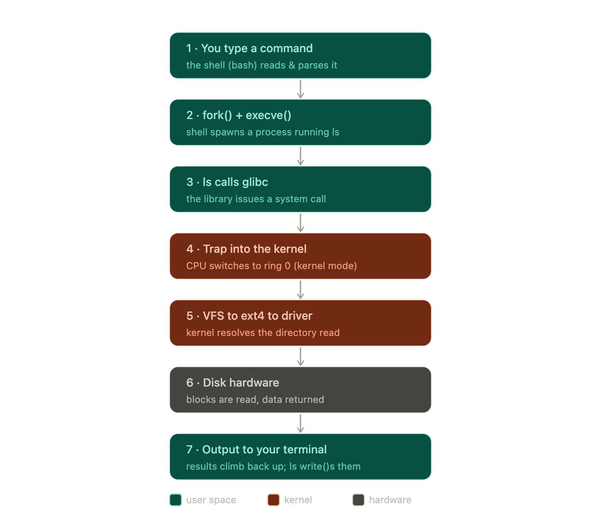

# What happens when you run the command ?

Here is the complete journey of something as simple as typing `ls` and pressing Enter:

1. you type `ls` and the _shell_ — itself just a user-space program — parses the line and recognizes it needs to run an external program.
2. It calls `fork()` to clone itself into a new child process, then the child calls `execvel()` to replace its own program image with `/usr/bin/ls`.
3. Now `ls` is running as its own process. To list a directory, `ls` calls a glibc function, which issues the actual system call (such as `getdents` "get directory entries").
4. That system call triggers thr trap: **the CPU leaves ring 3, enters ring 0, and lands at the kernel's system-call entry point**.
5. Inside the kernel, the VFS(virtual File System) receives the request, recognizes the directory lives on, say, an `ext4` filesystem, and hands off to the ext4 code, which asks the appropriate _device driver_ to fetch the relevant blocks from the disk. The hardware reads those blocks and returns the raw bytes.
6. Then the whole chain reverses: the data climbs back up through the driver, the filesystem, the VFS, across the system-call boundary (the CPU switches back to ring 3), and into ls, which formats the entries into neat columns and makes another system call — `write()` — to send that text to your terminal. The terminal displays it. When ls finishes, it exits, and the shell, which had been waiting via `wait()`, reaps the child and prints a fresh prompt.
