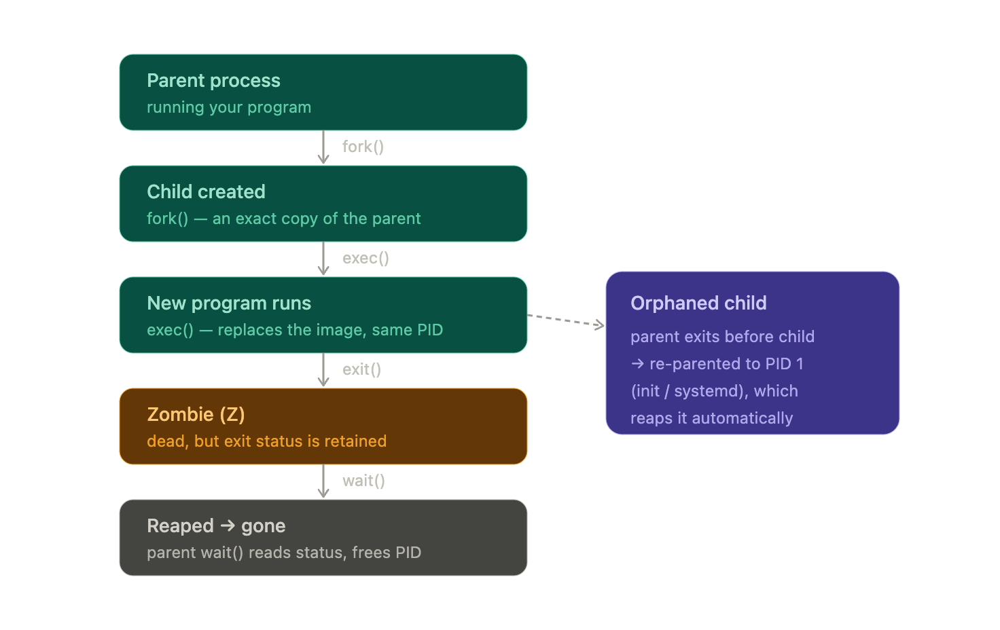

# Process Management & Job Controls

## 1. Process Lifecycle

A process is a running instance of a program with its own `PID`(process ID), memory space, and open file descriptors. 
> A process can only be created by copying an existing one. 
There is no *"create process from nothing"* call. 

1. `fork()` clones the calling process. The original is the **parent**, the copy is the child. `fork` returns twice - in the parent it returns the child's PID, in the child it returns 0 -- which is how each copy knows who it is. 
    * The childs gets a brand-new `PID` but inherits a copy of the parent's memory (cheaply, via copy-on-write) and its open file descriptors. 

2. `exec()` then replaces the child's program image with a new program, keeping the same PID and inherited file descriptors. 
    * *run a program* means `fork then exec` clone yourself, then have the clone become the target program.

3. `wait()` is how the parent collects a finished child. 
    * when the parent calls `wait()/waitpid()`, it blocks untill a child exits and then receives that child's exit status. This act is called `reaping`. 


4. `zombie`/`state z` is the process that has exited but hasn't been reaped yet. 
    * When a process has completed its execution or is terminated, it’ll send the `SIGCHLD` signal to the **parent process** and go into the zombie state. and will remain in this stae untill the parent process clears it off from te process table.
    * The kernel can't fully discard it because it must hold the exit status until the parent asks for it. 
    * You **cannot kill a zombie**, Its already *DEAD*; `kill -9` does nothing to it. 
    * The fix is to make the parent reap (or kill the parent, after which the zombie gets re-parented and reaped). 

5. `Orphan` process is where the parent exits before the child.
    * The child isn't killed; instead the kernel re-parents it to `PID 1`. Because `PID 1` always reaps its adopted children, orphans never become permanent zombies.
    * Which is why zombies are a parent's fault problem, not an orphan problem. 

6. `PID 1` is the first process the kernel starts at boot. It's special in three ways.
    * Its the ancestor of every other process, it adopts and reaps all orphans and the kernel protect it.
    * Signal liks `SIGKILL, SIGTERM` are ignored for `PID 1` unless `PID 1` has explicitly installed a handler for them. 

---
## 2. Process Groups and Sessions

#### Process Group
A **process group** is a set of related processes, typically a single pipeline. When you run `sort file | uniq | wc` all three commands form one process group with a shared `PGID` *equal to the PID of the group leader*.
    * The point of grouping is that you can signal the entire group at once. 
    * This is why pressing `ctrl+c` stops the whole pipeline and not just one stage - **The signal goes to the group**. 

#### Session 
A **session** is a set of process groups, usually everything launched from one login or one shell. 
    * It has a session ID and, importantly, at most one controlling terminal. 
    * Within a session there is exactly `one` **foreground process group**(which recevies keyboard input and terminal-generated signals) and `any` **number of background groups**
    * *The sessions leader is normally your shell*, *The controlling terminal is the linchpin*. 

#### Terminal 
A terminal in Linux is a **program that provides a command-line interface** (CLI) to interact with the operating system. It acts as a bridge between the user and the shell

A Linux **shell** is a program that takes commands from the user and passes them to the operating system for execution. The shell reads the commands, interprets them, and then invokes the appropriate system calls or programs to carry out the requested actions.

   - shell is a program that interprets and executes commands. When you open a terminal, you are presented with a prompt, which usually shows information such as the username, hostname, and current working directory.
   - Terminal generated signals - `SIGINT, SIGTSTP` are delivered only to the *foreground* group, which is why *background* jobs ignore your `ctrl+c`.
   - And when the terminal itself goes away (close the window or ssh drops), the kernel sends **SIGHUP** (hangup signal) to the session, and the shell relays it to its jobs.
   - Since `SIGHIP` signal default action is *terminate*, this is the mechamism that kills your background jobs when you log out.



> Refer to [Process Management Detailed Guide along with different state explination](../concepts/process.md)

---
# Signals in Depth

A signal is an asynchronous notification the kernel delivers to a process -- **essentailly a software interrupt**.

Each has a `number`, a `name` and a default `action`. For most signals, a process can do one of three things
* Let the default happen
* Catch it (run a handler function to do cleanup or custom logic) -- using [trap](../concepts/signals.md)
* Ignore it
* It can also temporarily block(queue) a signal. 


```bash
## Listing Signals

kill -l # This lists all supported signals on your system.

# Sending Signals
kill -15 1234  # Send SIGTERM to process with PID 1234

kill -9 1234   # Send SIGKILL
```
---
## Inspecting the Processes 

#### Process Information 
```bash
ps                      # Show running processes
ps aux                  # Show all processes with detailed info
ps -ef                  # Show processes in full format
top                     # Display running processes in real time
htop                    # Interactive process viewer (if installed)
```

#### CPU & Memory Usage
```bash
top                     # Show CPU and memory usage
free -m                 # Show memory usage in MB
vmstat                  # Show memory and CPU statistics
iostat                  # Show CPU and disk I/O statistics
mpstat                  # Show CPU usage per processor
```

#### Process Control
```bash
kill PID                # Kill a process by PID
kill -9 PID             # Force kill a process
pkill process_name      # Kill process by name
killall process_name    # Kill all instances of a process
```
> Refer to [commands](../commands/) to look into detailed guides about each command usage.

---
# Job Control
In the Linux operating system, *jobs refer to processes that are running in the background or foreground*. 

Job control refers to the ability to *manipulate these processes*, including suspending, resuming, and terminating them. This feature enables users to manage multiple tasks efficiently and debug process-related issues.

Job control is made possible by the `shell`

- **Foreground jobs** Run interactively in the current terminal session and block further input until completion
- **Background jobs** Run independently without blocking the terminal, allowing users to continue entering commands

### Job States
Jobs reported by the [jobs](../commands/jobs.md) command can be in one of these states:

- **Running** — the process is actively executing in the background.
- **Stopped** — the process has been suspended, typically by pressing Ctrl+Z.
- **Done** — the process has finished. This state appears once and is then cleared from the list.
- **Terminated** — the process was killed by a signal.

When a background job finishes, the shell displays its Done status the next time you press Enter or run a command.

### Job Control Commands

<table>
<thead>
<tr>
<th>Command</th>
<th>Purpose</th>
<th>Example Usage</th>
</tr>
</thead>
<tbody>
<tr>
<td><code>jobs</code></td>
<td>List active jobs</td>
<td><code>jobs -l</code></td>
</tr>
<tr>
<td><code>fg</code></td>
<td>Bring job to foreground</td>
<td><code>fg %1</code></td>
</tr>
<tr>
<td><code>bg</code></td>
<td>Send job to background</td>
<td><code>bg %1</code></td>
</tr>
<tr>
<td><code>kill</code></td>
<td>Terminate job</td>
<td><code>kill %1</code></td>
</tr>
<tr>
<td><code>Ctrl+Z</code></td>
<td>Suspend foreground job</td>
<td>Interactive keystroke</td>
</tr>
<tr>
<td><code>Ctrl+C</code></td>
<td>Terminate foreground job</td>
<td>Interactive keystroke</td>
</tr>
</tbody>
</table>

### Job Identification / Job Specification
Job specifications (job specs) let you target a specific job when using commands like `fg, bg, kill , or disown`. They always start with a percent sign `(%)`:

- `%1`, `%2`, … — refer to a job by its number.
- `%%` or `%+` — the current job (the most recently backgrounded or suspended job, marked with +).
- `%-` — the previous job (marked with -).
- `%string` — the job whose command starts with string. 
    * For example, `%ping` matches a job started with `ping google.com`.
- `%?string` — the job whose command contains string anywhere. 
    * For example, `%?google` also matches `ping google.com.`