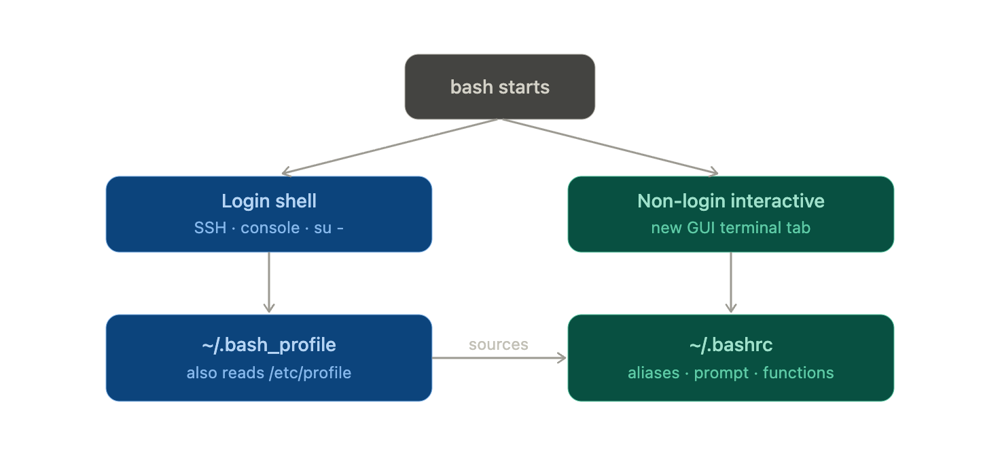

# Shell Configuration Files

bash doesn't read one config file — it reads different files depending on how it was started. There are two independent yes/no questions about any shell, and the combination decides which files run.

##### login vs non-login

- A login shell is what you get when you authenticate: logging in over SSH, switching users with `su -,` or sitting at a text console.
- A non-login shell is what you get when you open a new terminal tab in a desktop environment or just type bash — you're already logged in, so it skips the login files.

##### Interactive vs non-interactive

- An interactive shell has a prompt and waits for you to type.
- A non-interactive shell is one running a script with no human at the keyboard.

The bash or any other shell uses multiple profiles, also known as **_shell configuration_** files, like `“/etc/profile“`, `“~/.bash_profile“`, `“~/.profile“`, `“~/.bash_login“`, `“~/.bashrc“`, `“~/.bash_history“`, and `“~/.bash_logout”` to configure the user’s interactive login or non-login shell.

`.bashrc` and `.bash_profile `are hidden configuration files in Linux that customize the Bash shell environment, but they serve different purposes based on how the shell is invoked.


`.bashrc` is executed for interactive non-login shells. It runs every time you open a new terminal window, tab, or start a new Bash instance. It is best used for **per-session customizations** like aliases, shell functions, prompt appearance (PS1), and shell-specific options.

`.bash_profile` is executed for interactive login shells. It runs only once when you first log in to the system (e.g., via SSH, console login, or bash -l). It is best used for one-time login setup tasks, such as _setting global environment variables_ (like PATH), _starting background services_ (like ssh-agent), or _displaying welcome messages._

if you put an alias in `~/.bashrc` and then log in over SSH (a login shell), your alias isn't there — because login shells read `~/.bash_profile`, not `~/.bashrc`. The universal fix, which you'll find in almost every setup, is to make `~/.bash_profile` source `~/.bashrc`. i.e To ensure your configurations apply to all shell types, the standard practice is to place session-specific settings in `.bashrc` and have `.bash_profile` source it.

```bash
# in ~/.bash_profile
if [ -f ~/.bashrc ]; then
    . ~/.bashrc
fi
```

### Significance of `.profile`

During an interactive shell login, if `.bash_profile`is not present in the home directory, Bash looks for `.bash_login`. If found, Bash executes it. If `.bash_login` is not present in the home directory, Bash looks for `.profile` and executes it.

`.profile` can hold the same configurations as `.bash_profile` or `.bash_login`. It controls prompt appearance, keyboard sound, shells to open, and individual profile settings that override the variables set in the `/etc/profile` file.

---

<table><thead><tr><th>Files</th><th>Description</th></tr></thead><tbody><tr><td><code>/etc/profile</code></td><td>It stores the variables, aliases, functions, etc. that are applied for all users</td></tr><tr><td><code>~/.bash_profile</code></td><td>It loads the commands that need to be executed only once for the current shell environment</td></tr><tr><td><code>~/.profile</code></td><td>If “<code>~/.bash_profile</code>” does not exist, the system will look for this file</td></tr><tr><td><code>~/.bash_login</code></td><td>If “<code>~/.profile</code>” does not exist, the system will look for this file</td></tr><tr><td><code>~/.bashrc</code></td><td>All the commands (like variables, aliases, and functions) in this file will be loaded only for the interactive, non-login shell</td></tr><tr><td><code>~/.bash_history</code></td><td>It stores the history of user typed commands at the terminal and writes this file when the user exits the shell</td></tr><tr><td><code>~/.bash_logout</code></td><td><a href="https://linuxtldr.com/login-shell/" target="_blank" rel="noreferrer noopener">Login shell</a> cleanup file executed when a login shell exits</td></tr></tbody></table>

This configuration file is divided into two major categories.

#### 1. System Profiles

Major shells like `Bash`, ZSH, and Fish will look for system profiles located at `“/etc/profile”` and then source them in your current environment.

This profile is used to permanently set variables, aliases, functions, and handle critical components globally for all users, like the `PS1` configuration, the `PATH`, `variable`, and many more in your system.

This file is handled by your system (and only the root user has permission to perform any changes) to configure all new or existing user shell environments, so you do not have to interact with it unless you are sure about it.

#### 2. User’s Profiles

The user’s profiles are used to set `variables`, `aliases`, and `functions` for specific users.

For example, when you launch the interactive login shell, Bash will first look for the system profile located at the `“/etc/profile”` path and run all the commands in this file in order.

Then it will look for the following user’s profile, as listed in order:

1. `~/.bash_profile` (if it does not exist, then “`~/.profile”` will be looked at; if it also does not exist, then “`~/.bash_login`” will be looked at).
2. `~/.bashrc_history`
3. `~/.bashrc_logout`

Once your _interactive login shell_ is launched, you can _launch multiple interactive non-login shells_ by executing the bash command in your parent shell or by opening new terminal tabs.

Note that in this situation, your shell will not read the `“/etc/profile”` or `“~/.bash_profile”` (including “`~/.profile”` or `“~/.bash_login“`); instead, it will read the `“~/.bashrc”` file to load the interactive, non-login environment variables for the current user.

The following is the flow for an interactive, non-login shell.

1. `~/.bashrc`
2. `~/.bash_history`
3. `~/.bash_logout`

**So, if you want to execute something that needs to be executed only once when you boot your system, add it in the `“~/.bash_profile”` file, or if you want something to be executed every time you launch a terminal or create a sub-shell, add it in the `“~/.bashrc”` file.**

---

### Aliases

Bash aliases are simple text substitutions that replace a command name with a longer string.

Aliases are best used for simple shortcuts or adding default flags to existing commands, such as alias `ls='ls --color=auto'` or `alias ll='ls -lh'`.
They're pure substitution — the alias name is swapped for its text at the start of a command. They only work in interactive shells, not in scripts,

```bash
alias alias_name="command_to_run"   # Declare an Alias

alias    # list all aliases
alias name ## See the definition of a specific shortcut.
unalias name # remove alias
```

**alias will be available throughout the current shell session, but when you open a new terminal window, this will not be available.**

The `~/.bash_aliases` file is a dedicated configuration file used primarily in Ubuntu and Debian distributions to store user-defined command shortcuts separately from the main shell configuration.

Instead of cluttering the main `~/.bashrc` file—which contains critical shell settings, environment variables, and functions—this separate file allows you to manage shortcuts in isolation.

The `~/.bash_aliases` file is not loaded automatically by Bash itself. It functions only because the default ~/.bashrc file in Ubuntu/Debian includes a specific code block to check for and source it:

```bash
if [ -f ~/.bash_aliases ]; then
    . ~/.bash_aliases
fi
```

To make this persistent, we need to add this into one of the various files that is read when a shell session begins. Popular choices are `~/.bashrc` and `~/.bash_profile`. We just need to open the file and add the alias there:

```bash
alias ll="ls -lhA" ## Add this line directly in ~/.bashrc

# OR
if [ -f ~/.bash_aliases ]; then
    . ~/.bash_aliases
fi
# In `~/.bashrc`
```

---

### Source Command

The '`source`' command is a built-in feature of the shell, designed to execute commands stored within a file directly in the current shell environment.

- When you use the '`source`' command, it reads the contents of the specified file, typically a sequence of commands, and executes them as if they were typed directly into the terminal.
- This process happens within the context of the current shell session, without spawning a new process or interpreter.
- If any arguments are provided with the 'source' command, they are passed as positional parameters to the commands within the sourced file.

```bash
source FILENAME

source ~/.bashrc   # Loading configurations after changes
source script.sh   # Executing bash scripts
```

**The most common reason to use source is reloading your shell configuration without opening a new terminal: after editing `~/.bashrc`, run `source ~/.bashrc` and the changes take effect immediately in your current session.**

## <table><thead><tr><th tts-paragraph-index="32"><span class="tts-paragraph-player"><span class="tts-circle"></span><span class="tts-paragraph-player-button tts-play-icon" title="Play/Pause"></span></span>Task</th><th tts-paragraph-index="33"><span class="tts-paragraph-player"><span class="tts-circle"></span><span class="tts-paragraph-player-button tts-play-icon" title="Play/Pause"></span></span>Command</th></tr></thead><tbody><tr><td tts-paragraph-index="34"><span class="tts-paragraph-player"><span class="tts-circle"></span><span class="tts-paragraph-player-button tts-play-icon" title="Play/Pause"></span></span>Source a file</td><td><code tts-paragraph-index="35"><span class="tts-paragraph-player"><span class="tts-circle"></span><span class="tts-paragraph-player-button tts-play-icon" title="Play/Pause"></span></span>source filename.sh</code></td></tr><tr><td tts-paragraph-index="36"><span class="tts-paragraph-player"><span class="tts-circle"></span><span class="tts-paragraph-player-button tts-play-icon" title="Play/Pause"></span></span>Source using dot shorthand</td><td><code tts-paragraph-index="37"><span class="tts-paragraph-player"><span class="tts-circle"></span><span class="tts-paragraph-player-button tts-play-icon" title="Play/Pause"></span></span>. filename.sh</code></td></tr><tr><td tts-paragraph-index="38"><span class="tts-paragraph-player"><span class="tts-circle"></span><span class="tts-paragraph-player-button tts-play-icon" title="Play/Pause"></span></span>Reload <code>.bashrc</code></td><td><code tts-paragraph-index="39"><span class="tts-paragraph-player"><span class="tts-circle"></span><span class="tts-paragraph-player-button tts-play-icon" title="Play/Pause"></span></span>source ~/.bashrc</code></td></tr><tr><td tts-paragraph-index="40"><span class="tts-paragraph-player"><span class="tts-circle"></span><span class="tts-paragraph-player-button tts-play-icon" title="Play/Pause"></span></span>Reload <code>.bash_profile</code></td><td><code tts-paragraph-index="41"><span class="tts-paragraph-player"><span class="tts-circle"></span><span class="tts-paragraph-player-button tts-play-icon" title="Play/Pause"></span></span>source ~/.bash_profile</code></td></tr><tr><td tts-paragraph-index="42"><span class="tts-paragraph-player"><span class="tts-circle"></span><span class="tts-paragraph-player-button tts-play-icon" title="Play/Pause"></span></span>Source with arguments</td><td><code tts-paragraph-index="43"><span class="tts-paragraph-player"><span class="tts-circle"></span><span class="tts-paragraph-player-button tts-play-icon" title="Play/Pause"></span></span>source filename.sh arg1 arg2</code></td></tr></tbody></table>

---

### Functions

Bash functions are reusable blocks of commands defined in configuration files like `~/.bashrc` or `~/.bash_profile` to simplify workflows and override default command behavior.

Functions are typically defined using the syntax `function_name () { commands }` and can accept positional parameters `(e.g., $1, $2)` to handle arguments.

**Example**: "make a directory and cd into it":

```bash
mkcd() { mkdir -p "$1" && cd "$1"; }
```

---

### `tmux` - The terminal multiplexer

Learn more about [tmux](../commands/tmux.md)
