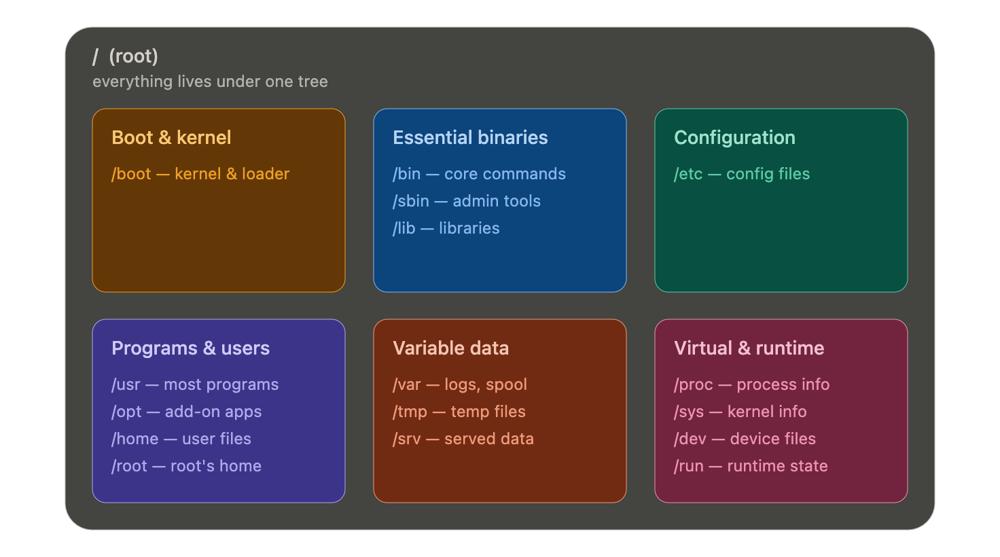

# Linux File System

Everything — every file, every directory, every device, every partition, even hardware — lives under a single root directory called `/` (pronounced "_slash_" or "**root**"). There is exactly one top of the tree, and everything branches off from it.

This structure isn't arbitrary — it's governed by a written specification called the **Filesystem Hierarchy Standard (FHS)**, maintained by the Linux Foundation. It's why a /etc directory means roughly the same thing on _Ubuntu, Fedora, Debian, and Arch_.


---

## In-depth Analysis



#### 1. Essential Binaries

1. `/bin` holds the essential command binaries — the programs every **user** needs and that must be available even when the system is in a minimal state. Think *ls, cp, mv, cat, bash*. 
2. `/sbin` is the same idea but for **system binaries**: administrative tools meant primarily for the root user, like *fsck (filesystem check), reboot, ip, and mount*. The "`s`" stands for "**system**," not "secure," which is a common misconception. 
3. `/lib` contains the shared libraries those binaries depend on — along with kernel modules in `/lib/modules`.

###### There is also a `/usr/bin`, `/usr/sbin`, and `/usr/lib`. So why two of each?
Early Unix systems ran out of disk space, so developers added another disk and mounted it at `/usr`. Extra programs were moved there. That accident became a long-term convention.
* Today, many Linux systems no longer really keep them separate. So `/bin` and `/usr/bin` may look like two places, but often they are actually the same place through symbolic links.
```ini
/bin -> /usr/bin
/sbin -> /usr/sbin
/lib -> /usr/lib
```
4. **Configuration**: `/etc` is where all system-wide configuration lives, **it contains only static configuration files**. It holds things like `/etc/passwd` (user accounts), `/etc/fstab` (which filesystems to mount at boot), `/etc/hostname`, **network configuration**, and the config files for nearly every installed service. 
    * The key conceptual property: `/etc` is host-specific — it describes the configuration of this one machine and is not meant to be shared with other machines.

### Variable data: `/var`, `/tmp`, `/srv`

This group is defined by one shared property: **the data here changes during normal operation**. 
5. `/var` short for *("variable")*  is where programs store runtime information like **system logs** in `/var/log`, the print and mail queues in `/var/spool`, package manager caches in `/var/cache`, **databases**, and website files for some server setups in `/var/www`. 
    * The files stored here are NOT cleaned automatically and hence it provides a good place for system administrators to look for information about their system behavior. 
    * When a disk fills up unexpectedly, `/var/log` is usually the first place to look.

6. `/tmp` is for temporary files that programs create during execution. 
    * The crucial thing to know is that `/tmp` is typically wiped on reboot (and on many modern systems it's a RAM-backed filesystem that never touches disk), so never store anything there you want to keep. There's also `/var/tmp` for temporary files that should survive a reboot.
    * But do note that the contains of the `/tmp` directories are deleted when your system restarts. 

7. `/srv` **("service")** holds data served by the system to the outside world.
    * The `/srv` directory contains data for services provided by the system. For example, if you run a HTTP server, it’s a good practice to store the website data in the `/srv` directory.
    * for example, the files served by a web or FTP server. It's somewhat underused; many setups put web content in `/var/www` instead, but /srv is the FHS-blessed location.

### The virtual filesystems: `/proc`, `/sys`, `/dev`, `/run`

<p>This group is conceptually the most interesting because these directories don't exist on disk at all. They are virtual filesystems that the kernel generates in memory and presents as files.</p> 
<p>They embody the deepest Unix philosophy — "everything is a file" — by exposing the running system's internal state as readable, sometimes writable, files.</p>

8. `/proc` **("process")** is a window into the running kernel and every running process. contains the information about currently running processes and kernel parameters.
    * Each process gets a numbered directory `(/proc/1234/)` containing its **status, memory maps, and open file descriptors**. 
    * Files like `/proc/cpuinfo` and `/proc/meminfo` describe your hardware. 
    * You can `cat /proc/cpuinfo` right now to see your CPU details — that file occupies zero bytes on disk; the kernel produces its contents on the fly each time you read it.
    * **The content of the proc directory is used by a number of tools to get `runtime system` information.**

9. `/sys` **("sysfs")** is a newer, more structured cousin of `/proc`, exposing information about **devices, drivers, and kernel subsystems**. 
    * It's where you'd adjust things like screen brightness or read battery status by writing to files.

10. `/dev` **("devices")** contains device files — special files that represent hardware and pseudo-devices. These are virtual files, not physically on the disk.
    * `/dev/sda` is your **first disk**, 
    * `/dev/null` is the famous **"bit bucket"** that discards anything written to it, 
    * `/dev/zero` produces endless zero bytes, and 
    * `/dev/random` produces random data. 
    * **Reading from and writing to these files is how programs talk to hardware.**

11. `/run` holds runtime data about the system since the last boot — 
    * *process IDs* of running services, *sockets*, and lock files. 
    * Like `/tmp`, **it's memory-backed and cleared on every boot**. 
    * It exists to give early-boot processes a place to write state before the disk-based filesystems are even available.

### User space and add-ons: `/home`, `/root`, `/opt`

12. `/home` is where regular users' personal directories live — `/home/alice`, `/home/bob` — each containing that user's documents, downloads, and per-user configuration (the hidden "dotfiles" like .bashrc). This is the equivalent of `C:\Users` on Windows.
    * When you create a user on your Linux system, it’s a general practice to create a home directory for the user.

13. `/root` (note: distinct from /, the root directory) is the home directory for the `root/administrator` user specifically. It's deliberately not placed under `/home` because `/home` is sometimes on a separate partition that might not be mounted during recovery, and the administrator needs a usable home directory even then.

14. `/opt` **("optional")** is for self-contained third-party software packages that don't follow the standard distribution layout — often large commercial applications that prefer to keep everything **(binaries, libraries, config)** bundled in one place like **/opt/google/chrome**.
    * The normal practice is to keep the software code in `/opt` and then link the binary file in the `/bin` directory so that all the users can run it.

### Boot and mounting: `/boot`, `/mnt`, `/media`

15. `/boot` contains everything needed to start the system before the main filesystem is up: 
    * the Linux kernel image itself (vmlinuz), 
    * the initial RAM disk (initramfs), and 
    * the bootloader configuration (GRUB). 
    * This is frequently on its own small partition.

16. `/mnt` is a conventional, generic mount point — historically where an administrator would temporarily mount a filesystem manually.
    * This is similar to the /media directory but instead of automatically mounting the removable media, mnt is used by system administrators to manually mount a filesystem.

17. `/media`, by contrast, is where the system automatically mounts removable media like **USB** sticks and **DVDs** when you plug them in, typically creating a subdirectory named after the device or its label.
    * When you connect a removable media such as USB disk, SD card or DVD, a directory is automatically created under the `/media` directory for them. You can access the content of the removable media from this directory.

---

The two axes that tie it all together
1. The first axis is *static versus variable*.
    * Static data doesn't change without administrator action — binaries in `/usr`, config in `/etc`. 
    * Variable data changes during operation — logs in `/var`, temp files in `/tmp`. 
    * This separation lets you mount `/usr` as read-only for security and stability while keeping the writable parts elsewhere.

2. The second axis is **shareable versus unshareable**. 
    * Shareable data could be served over a network to multiple machines — `/usr` and `/opt` can be shared from one server to many clients. 
    * Unshareable data is specific to one host — `/etc` (this machine's config) and `/boot` (this machine's kernel) make no sense to share.

---

## Visualizing File System

The `tree` command in Bash is a powerful utility for visualizing the directory structure of a path or the entire file system in a tree-like format. 
- It lists directories, subdirectories, and files in a hierarchical manner, making it easier to understand the organization of files and directories within a given path.

```bash
sudo apt-get install tree

tree                 # This will output the directory structure starting from the current directory.
tree -d target_directory # List only directories:
 tree -a target_directory # Include hidden files
  tree -L 2 # display to a certian depth
   tree -p target_directory # List files with permissions
```
* use `man` pages to know more about the ability of `tree` command.

```bash
root@ubuntu-host / ✖ tree -d -L 1
.
├── bin -> usr/bin
├── bin.usr-is-merged
├── boot
├── dev
├── etc
├── home
├── lib -> usr/lib
├── lib.usr-is-merged
├── lib64 -> usr/lib64
├── media
├── mnt
├── opt
├── proc
├── root
├── run
├── sbin -> usr/sbin
├── sbin.usr-is-merged
├── srv
├── sys
├── tmp
├── usr
└── var
```