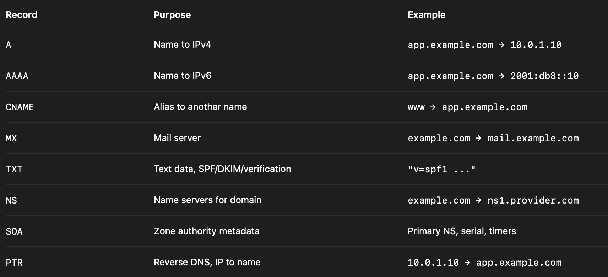
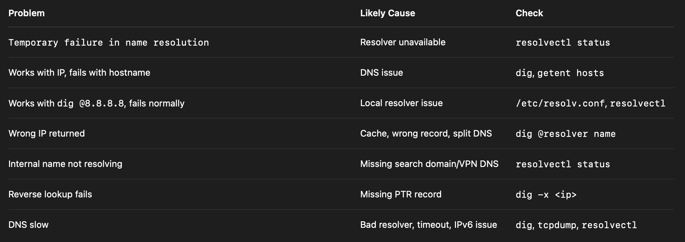

# Domain Name System (DNS) and Name Resolution

[Working of DNS](https://github.com/hemanthnarayanaswamy/System-Design-Bootcamp/blob/main/notes/Networking/dns.md)

DNS converts a hostname into an IP address. `google.com → 142.250.x.x`

DNS matters when:

```ini
Application URL is not resolving
Pod cannot resolve service name
Server cannot reach external domains
Internal domain resolves to wrong IP
DNS works on one server but not another
```

## Basic Resolution Flow

When Linux resolves a hostname, the common flow is:

```bash
/etc/hosts
↓
local resolver config: /etc/resolv.conf
↓
local DNS stub/cache, usually systemd-resolved on Ubuntu
↓
upstream recursive resolver
↓
root DNS servers
↓
TLD DNS servers
↓
authoritative DNS servers
↓
IP returned
```


> `/etc/resolv.conf` does not contain DNS records. It usually tells Linux which DNS resolver to ask.

```bash
cat /etc/resolv.conf

nameserver 127.0.0.53
# That means local apps send DNS queries to systemd-resolved, which then forwards them to upstream DNS servers. systemd-resolved provides a local DNS stub on 127.0.0.53.
```

##### `/etc/hosts`

Linux checks `/etc/hosts` before DNS in most default setups.

```bash
cat /etc/hosts

127.0.0.1       localhost
10.0.1.20       app01.internal
# If a hostname exists in /etc/hosts, Linux can resolve it without querying DNS.
```

##### `/etc/resolv.conf`

This file tells the system which DNS resolver to use.

This is a plain text file that contains the IP address of the DNS server that the system should use for hostname resolution.

- To add a DNS server, we simply need to insert a “nameserver” line followed by the IP address of the DNS server.

```bash
cat /etc/resolv.conf

# nameserver 127.0.0.53
# options edns0 trust-ad
# search internal.example.com

# nameserver - DNS resolver IP
# search - Domain suffix automatically tried
# options - Resolver bahavior options
```

##### Hostname to IP Resolution Order - `/etc/nsswitch.conf`

The order of hostname-to-IP mapping lookup can be specified in the `/etc/nsswitch.conf` file. This file specifies the order of the lookup methods used by the system’s Name Service Switch (NSS) library.

```bash
# By default, the file includes a line that specifies
# /etc/nsswitch.conf
hosts:          files dns

# The system first looks in the /etc/hosts file for hostname-to-IP mappings, and if the hostname is not found in the file, it queries a DNS server to resolve the hostname.

# /etc/nsswitch.conf
hosts:          dns files

# The system first queries the DNS server for hostname-to-IP mappings, and if the hostname is not found in the DNS server, it looks in the /etc/hosts file.
```

## DNS Records



## Key DNS Linux Commands

##### 1. `dig` Command

[dig](../commands/dns/dig_nslookup_host.md) command stands for Domain Information Groper. It retrieves information about DNS name servers. Network administrators use it to verify and troubleshoot DNS problems and perform DNS lookups.

##### 2. `nslookup` Command

The [nslookup](../commands/dns/dig_nslookup_host.md) command is a network administration tool used to query DNS servers to obtain domain name or IP address mappings and other DNS records. It operates in two modes: interactive, which allows multiple queries and configuration changes, and non-interactive, which performs a single query and is ideal for scripting.

##### 3. `nmap` Command

[nmap](../commands/network-diagnostics/nmap.md) is a powerful network scanning tool used for host discovery, port scanning, and service detection.

## `systemd-resolved` on Ubuntu

Modern Ubuntu commonly uses `systemd-resolved` for local name resolution. It provides DNS resolution, caching, and a local stub resolver. Ubuntu/systemd documentation describes it as a system service for local applications, with the stub commonly exposed at 127.0.0.53.

- Configuration: DNS servers are determined by global settings in `/etc/systemd/resolved.conf`
- The service listens on _127.0.0.53_ to allow applications to bypass direct DNS connections; `/etc/resolv.conf` is typically symlinked to `/run/systemd/resolve/stub-resolv.conf` to direct traffic to this stub.
- Applications can interact with `systemd-resolved` using the `resolvectl` command-line tool to query status, flush caches, or set per-interface DNS parameters.

```bash
resolvectl status # check status

resolvectl dns # check dns server being used

resolvectl query example.com # check dns resolution

sudo resolvectl flush-caches # Flush DNS cache

resolvectl statistics # show cache statisitics

sudo systemctl restart systemd-resolved # restart resolver

systemctl status systemd-resolved # check service
```

## TTL, Caching and Propagation

TTL means Time To Live.

- It tells DNS resolvers how long they may cache a DNS answer.

```bash
dig example.com

example.com.  300  IN  A  93.184.216.34
# 300 = TTL in seconds
# Resolver can cache this answer for 300 seconds.
```

## DNS Troubleshooting Flow

1. Check local hosts file. If an entry exists, it may override DNS.

```bash
grep example.com /etc/hosts
```

2. Check Resolver config

```bash
cat /etc/resolv.conf
```

- On Ubuntu, `127.0.0.53` usually means systemd-resolved is handling DNS locally.

3. Test System Resolution

```bash
getent hosts example.com
```

This tests resolution through LInux NSS, including `/etc/hosts` and DNS

The `getent` command in Linux is a versatile utility used to retrieve entries from system databases managed by the **Name Service Switch (NSS)**. It provides a unified interface to query information from various sources, including local files (like `/etc/passwd`) and network services (such as LDAP, NIS, or DNS), ensuring that administrators see all configured user and host data rather than just local static entries.

```bash
getent [database] [key]

passwd: Retrieves user account information (username, UID, home directory).
group: Retrieves group account information (group name, GID, members).
hosts: Resolves hostnames to IP addresses.
services: Lists network services and their associated ports.
```

4. Test with `dig`

```bash
dig example.com
```

5. Test a known public resolver

```bash
dig @8.8.8.8 example.com
```

**If this works but normal dig example.com fails, your local resolver or configured upstream DNS is likely the issue.**

6. Check `systemd-resolved`

```bash
resolvectl status
resolvectl query example.com
```

7. Trace delegation

```bash
dig +trace example.com
```

_Use this for domain-level issues like wrong NS records, broken delegation, or authoritative DNS problems._

8. Check network path to DNS

```bash
ping 8.8.8.8

mtr -rw -c 50 8.8.8.8

sudo tcpdump -i any -nn 'port 53'
```

DNS usually uses `UDP/53`, but can also use `TCP/53`

## Common DNS Problems



## Quick Reference

```bash
cat /etc/hosts
cat /etc/resolv.conf
getent hosts <hostname>

dig <domain>
dig +short <domain>
dig @8.8.8.8 <domain>
dig +trace <domain>
dig -x <ip>

resolvectl status
resolvectl dns
resolvectl query <domain>
sudo resolvectl flush-caches

sudo tcpdump -i any -nn 'port 53'

/etc/hosts = local static names
/etc/resolv.conf = where to send DNS queries
systemd-resolved = local Ubuntu DNS stub/cache
upstream resolver = recursive DNS server
authoritative DNS = source of truth for a domain
TTL = how long DNS answers can be cached
```
