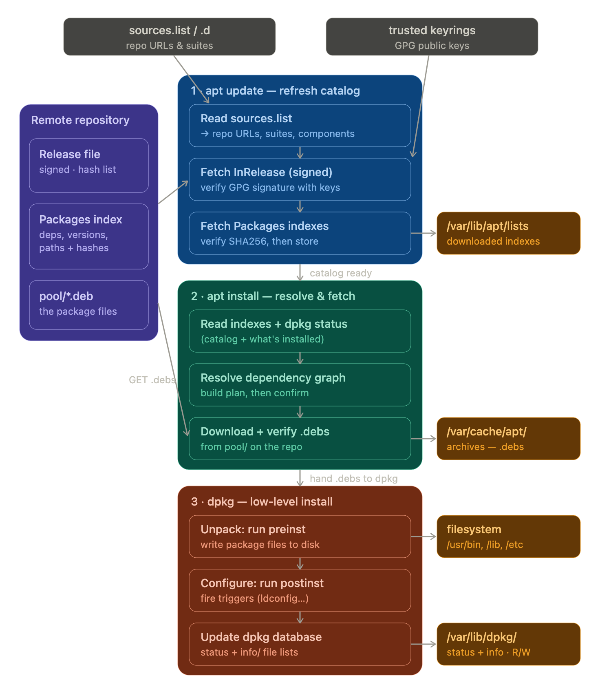

# The `apt` command

apt is designed for interactive use. Prefer using `apt-get` and `apt-cache` in your **shell scripts** as they are backward compatible between the different versions and have more options and features.

## APT architecture and Components


## Installing Packes

1. Installing packages is as simple as running the following command:

```bash
sudo apt install package_name

sudo apt install package1 package2
```

2. To install local `deb` files provide the full path to the file. Otherwise, the command will try to retrieve and install the package from the APT repositories.

```bash
sudo apt install /full/path/file.deb
```

## Upgrading Packages

Regularly updating your Linux system is one of the most important aspects of overall system security.

1. To upgrade the installed packages to their latest versions run:

```bash
sudo apt upgrade
```

2. If you want to upgrade a single package, pass the package name:

```bash
sudo apt upgrade package_name
```

## Full Upgrading

```bash
sudo apt full-upgrade
```

The difference between `upgrade` and `full-upgrade` is they differ in how they handle dependencies and package removals.

#### apt upgrade

- Updates all installed packages to the latest versions available in the repositories.
- Will not remove any currently installed packages.
- If an upgrade requires _removing or installing new packages to resolve dependencies_, it will hold back those packages instead of making changes that could break the system.
- Safe for routine updates.

#### apt full-upgrade

- Performs the same function as `apt upgrade` but can remove existing packages if necessary to complete the upgrade.
- Useful for major system upgrades (e.g., upgrading to a new Ubuntu release) where package dependencies have changed.
- Can install new packages and remove obsolete ones to satisfy dependency changes.
- **Requires caution**, as it may remove packages critical to your workflow.

## Reinstalling Packages

If a package is broken or you want to restore its files, reinstall it with:

```bash
sudo apt install --reinstall package_name
```

## Removing Packages

1. To remove an installed package type the following:

```bash
sudo apt remove package_name

sudo apt remove package1 package2
```

2. The `remove` command will uninstall the given packages, but it may leave some **configuration files** behind. If you want to remove the package including all configuration files, use `purge` instead of remove:

```bash
sudo apt purge package_name
```

## Remove Unused Packages

Whenever a new package that depends on other packages is installed on the system, the package dependencies will be installed too. When the package is removed, the dependencies will stay on the system. These leftover packages are no longer used by anything else and can be removed.

1. To remove the unneeded dependencies use the following command:

```bash
sudo apt autoremove
```

2. To remove unused packages and their configuration files, run:

```bash
sudo apt autoremove --purge
```

## Listing Packages

1. To list all available packages use the following command:

```bash
sudo apt list
```

The command will print a list of all packages, including information about the versions and architecture of the package. To find out whether a specific package is installed, you can filter the output with the `grep` command.

2. To list only the installed packages

```bash
sudo apt list --installed
```

3. Getting a list of the upgradable packages may be useful before actually upgrading the packages:

```bash
sudo apt list --upgradeable
```

## Advanced APT usage

1. Sometimes you need to prevent certain packages from being updated:

```bash
# Hold a package at current version
sudo apt-mark hold nginx

# Unhold a package
sudo apt-mark unhold nginx

# List held packages
apt-mark showhold
```

## Reporitory Management

APT repositories are configured in `/etc/apt/sources.list` and files in `/etc/apt/sources.list.d/`:

```bash
# Add a repository (example: Docker)
curl -fsSL https://download.docker.com/linux/ubuntu/gpg | sudo apt-key add -
sudo add-apt-repository "deb [arch=amd64] https://download.docker.com/linux/ubuntu $(lsb_release -cs) stable"

# Remove a repository
sudo add-apt-repository --remove "deb [arch=amd64] https://download.docker.com/linux/ubuntu $(lsb_release -cs) stable"
```

## Work Flow


