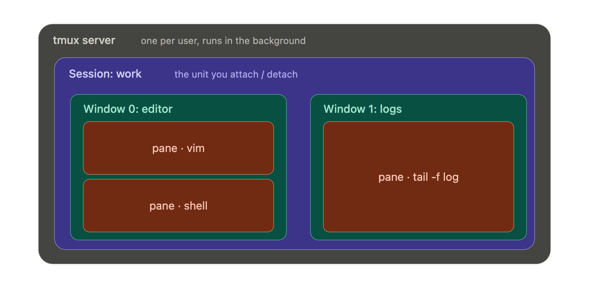

# The `tmux` commands

`tmux` lets you run many terminal sessions inside a single window, but its real superpower is persistence: a tmux session keeps running on the machine even after you disconnect.

- You can start a long job on a remote server, detach, close your laptop, and reconnect hours later to find everything exactly as you left it — output and all.
- For anyone working over `SSH`, this alone makes it indispensable, because a dropped connection no longer kills your work.

