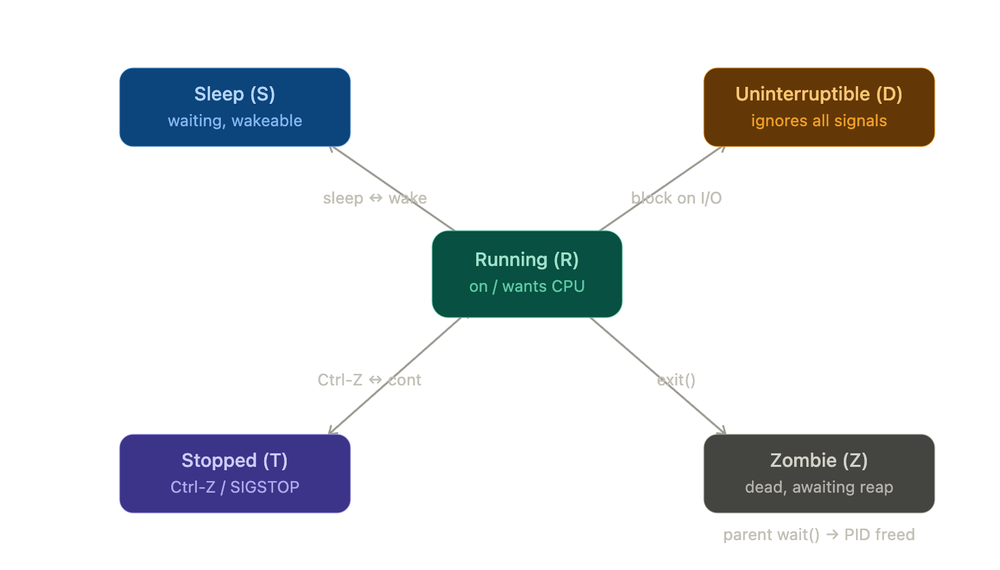

# Process Management

## 1. Process Lifecycle

A process is a running instance of a program with its own `PID`(process ID), memory space, and open file descriptors. 
> A process can only be created by copying an existing one. 
There is no *"create process from nothing"* call. 

1. `fork()` clones the calling process. The original is the **parent**, the copy is the child. `fork` returns twice - in the parent it returns the child's PID, in the child it returns 0 -- which is how each copy knows who it is. 
    * The childs gets a brand-new `PID` but inherits a copy of the parent's memory (cheaply, via copy-on-write) and its open file descriptors. 

2. `exec()` then replaces the child's program image with a new program, keeping the same PID and inherited file descriptors. 
    * *run a program* means `fork then exec` clone yourself, then have the clone become the target program.

3. `wait()` is how the parent collects a finished child. 
    * when the parent calls `wait()/waitpid()`, it blocks untill a child exits and then receives that child's exit status. This act is called `reaping`. 

4. `zombie`/`state z` is the process that has exited but hasn't been reaped yet. 
    * The kernel can't fully discard it because it must hold the exit status until the parent asks for it. 
    * You **cannot kill a zombie**, Its already *DEAD*; `kill -9` does nothing to it. 
    * The fix is to make the parent reap (or kill the parent, after which the zombie gets re-parented and reaped). 

5. `Orphan` process is where the parent exits before the child.
    * The child isn't killed; instead the kernel re-parents it to `PID 1`. Because `PID 1` always reaps its adopted children, orphans never become permanent zombies.
    * Which is why zombies are a parent's fault problem, not an orphan problem. 

6. `PID 1` is the first process the kernel starts at boot. It's special in three ways.
    * Its the ancestor of every other process, it adopts and reaps all orphans and the kernel protect it.
    * Signal liks `SIGKILL, SIGTERM` are ignored for `PID 1` unless `PID 1` has explicitly installed a handler for them. 

---
## 2. Process Groups and Sessions

#### Process Group
A **process group** is a set of related processes, typically a single pipeline. When you run `sort file | uniq | wc` all three commands form one process group with a shared `PGID` *equal to the PID of the group leader*.
    * The point of grouping is that you can signal the entire group at once. 
    * This is why pressing `ctrl+c` stops the whole pipeline and not just one stage - **The signal goes to the group**. 

#### Session 
A **session** is a set of process groups, usually everything launched from one login or one shell. 
    * It has a session ID and, importantly, at most one controlling terminal. 
    * Within a session there is exactly `one` **foreground process group**(which recevies keyboard input and terminal-generated signals) and `any` **number of background groups**
    * *The sessions leader is normally your shell*, *The controlling terminal is the linchpin*. 

#### Terminal 
A terminal in Linux is a **program that provides a command-line interface** (CLI) to interact with the operating system. It acts as a bridge between the user and the shell

A Linux **shell** is a program that takes commands from the user and passes them to the operating system for execution. The shell reads the commands, interprets them, and then invokes the appropriate system calls or programs to carry out the requested actions.

   - shell is a program that interprets and executes commands. When you open a terminal, you are presented with a prompt, which usually shows information such as the username, hostname, and current working directory.
   - Terminal generated signals - `SIGINT, SIGTSTP` are delivered only to the *foreground* group, which is why *background* jobs ignore your `ctrl+c`.
   - And when the terminal itself goes away (close the window or ssh drops), the kernel sends **SIGHUP** (hangup signal) to the session, and the shell relays it to its jobs.
   - Since `SIGHIP` signal default action is *terminate*, this is the mechamism that kills your background jobs when you log out.

---
## 3. [The Linux Process States](https://www.baeldung.com/linux/process-states)
In Linux, a process is an instance of executing a program or command. While these processes exist, they’ll be in one of the five possible states:
* Running or Runnable (R)
* Uninterruptible Sleep (D)
* Interruptable Sleep (S)
* Stopped (T)
* Zombie (Z)

A parent process can initiate a child process using the `fork()` system call. Once it starts, ***the process goes into the running or runnable state.*** While the process is running, 
    * it could come into a code path that requires it to wait for particular resources or signals before proceeding. While waiting for the resources, the process would voluntarily give up the CPU cycles by going into one of the **two sleeping states**.
    * Additionally, we could suspend a running process and put it into the **stopped state**. Usually, this is done by sending the `SIGSTOP` signal to the process. 
    * A process in stopped state will continue to exist until it is **killed or resumed** with `SIGCONT`. 
    * Finally, the process completes its lifecycle when it’s terminated and placed into a **zombie state** until its parent process clears it off the process table.

#### 3.1 Running or Runnable State - R
When a new process is started, it’ll be placed into the running or runnable state. **In the running state, the process takes up a CPU core to execute its code and logic**. However, the thread scheduling algorithm might force a running process to give up its execution right.
    - This is to ensure each process can have a fair share of CPU resources. In this case, the process will be placed into a run queue, and its state is now a *runnable state waiting for its turn to execute*.
    - Although the running and runnable states are distinct, they are collectively grouped into a single state denoted by the character `R`.

#### 3.2 Sleeping State: Interruptible `S` and Uninterruptible `D`
During process execution, it might come across a portion of its code where it needs to request external resources. Mainly, the request for these resources is IO-based such as to read a file from disk or make a network request. Since the process couldn’t proceed without the resources, it would stall and do nothing. In events like these, they should give up their CPU cycles to other tasks that are ready to run, and hence they go into a sleeping state.

There are two different sleeping states: 
1. **uninterruptible sleeping state** (D) waits for the resources to be available before it moves into a runnable state and *doesn’t react to any signals*.
2. **interruptible sleeping state** (S) is the interruptible sleeping state (s) that will react to signals and the availability of resources.
    * A process enters the S state, or Interruptible Sleep, when it waits for an event or condition that is not directly related to an I/O operation.

#### 3.3 Stopped State `T`
**From a running or runnable state, we could put a process into the stopped state (T) using the `SIGSTOP` or `SIGTSTP` signals.**

1. we send the `SIGSTOP` programmatically, such as running `kill -STOP {pid}`. Additionally, the *process cannot ignore this signal* and will go into the stopped state. 
2. we send the `SIGTSTP` signal using the keyboard `CTRL + Z`. Unlike `SIGSTOP`, the *process can optionally ignore this signal* and continue to execute upon receiving `SIGTSTP`.
    * While in this state, we could bring back the process into a running or runnable state by sending the `SIGCONT` signal.

#### 3.4 Zombie State `Z`
When a process has completed its execution or is terminated, it’ll send the `SIGCHLD` signal to the **parent process** and go into the zombie state. and will remain in this stae untill the parent process clears it off from te process table. 
> To clear the terminated child process off the process table, the parent process must read the exit value of the child process using the `wait() or waitpid()` system calls.

---
### 4. Checking Process State

we can use command-line tools like `ps` and `top` to check the state of processes.

[ps](../commands/ps.md)
[top](../commands/top.md)

To Terminate the process manually. The [kill](../commands/kill.md) command sends a signal to a process which terminates the process. If the user doesn’t specify any signal which is to be sent along with kill command then default TERM signal is sent that terminates the process.

Refer to [SIGNALS](./signals.md)